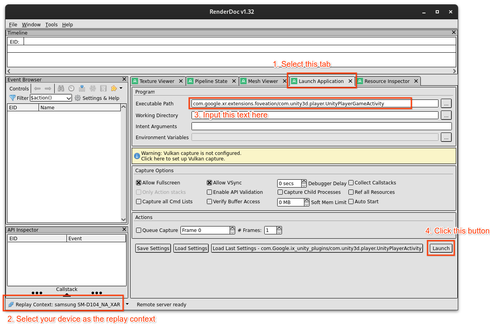
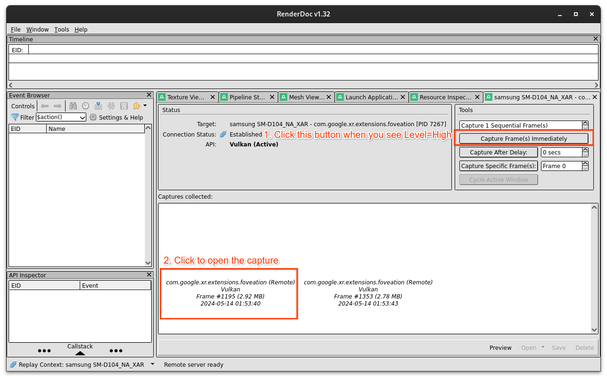
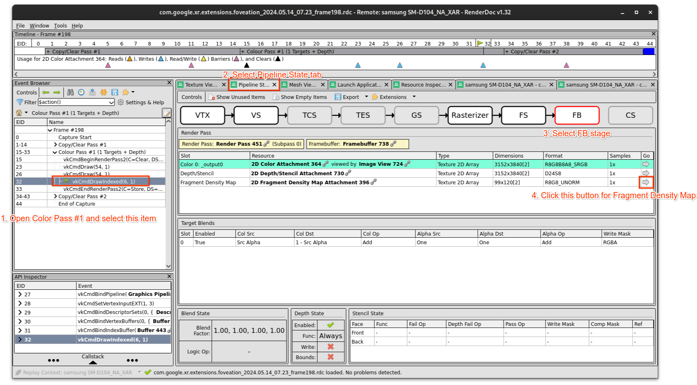
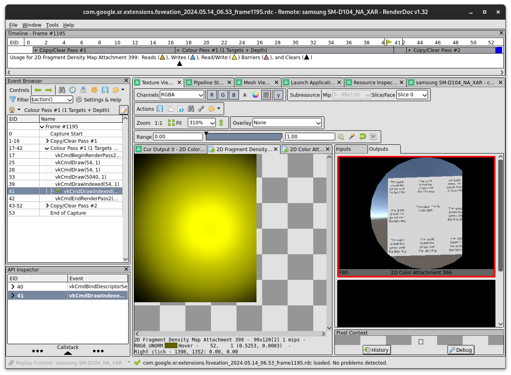
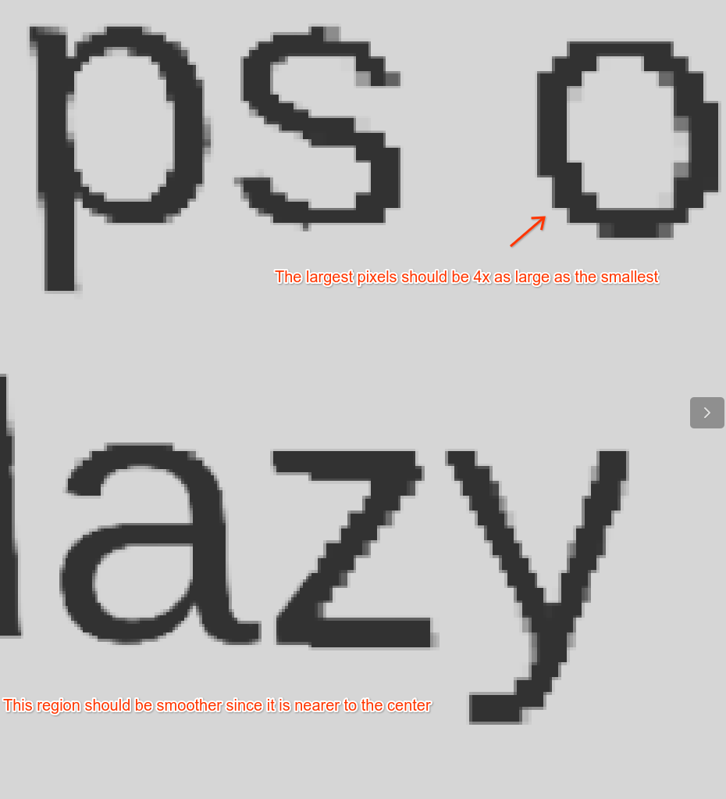

# Foveation Sample

Demonstrates Foveated Rendering for OpenXR runtime target Android Platform.

## Turn on Foveation Feature

To enable this sample:

*   Navigate to **Edit** > **Project Settings** > **XR Plug-in Management** >
    **OpenXR**.
*   Switch to the **Android** platform tab.
*   Select **Android XR (Extensions) Session Management**.
*   Select **Foveation** feature.
*   Under **XR Plug-in Management > Project Validation**, fix all **OpenXR**
    related issues. This will help to configure your **Player Settings**.

## Debug the Vulkan Foveation Feature using RenderDoc
When the Vulkan graphics API is selected in the Unity player settings, Unity performs foveated rendering using the Vulkan extension [VK_EXT_fragment_density_map]( https://registry.khronos.org/vulkan/specs/1.3-extensions/man/html/VK_EXT_fragment_density_map.html). If your app uses the Vulkan graphics API, you can ensure that your app is performing foveated rendering by inspecting an API trace using RenderDoc. The following steps show how to take a RenderDoc capture of the sample app to verify that Unity is rendering a foveated image.

1. Download the RenderDoc graphics debugger from https://renderdoc.org/.

1. Launch RenderDoc, connect RenderDoc to your device and launch the Vulkan sample APK. You should see the Unity app launch on the headset. 

1. If the app is launched correctly, you should see a screen like below. Take a capture when you see “Level=High” in the center of the screen. Open the capture. 

1. Open _Color Pass #1_ and select the last draw command, from there open the pipeline state tab, select _FB_ stage and then open the fragment density map resource. 

1. Confirm you see an image like the yellow one below. A yellow circular pattern on top of a black background indicates that Unity is obtaining a valid fragment density map. 

1. Additionally, you can download the final 2D color attachment and visually inspect the result for regions of lower resolution as shown below. 

