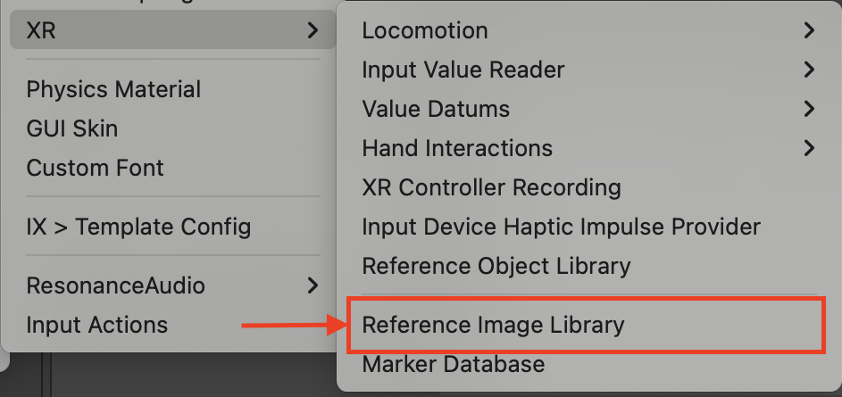
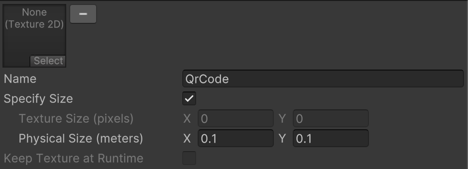
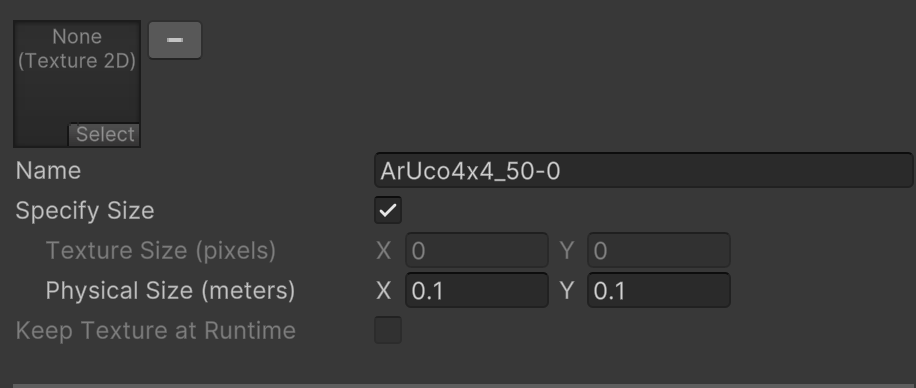
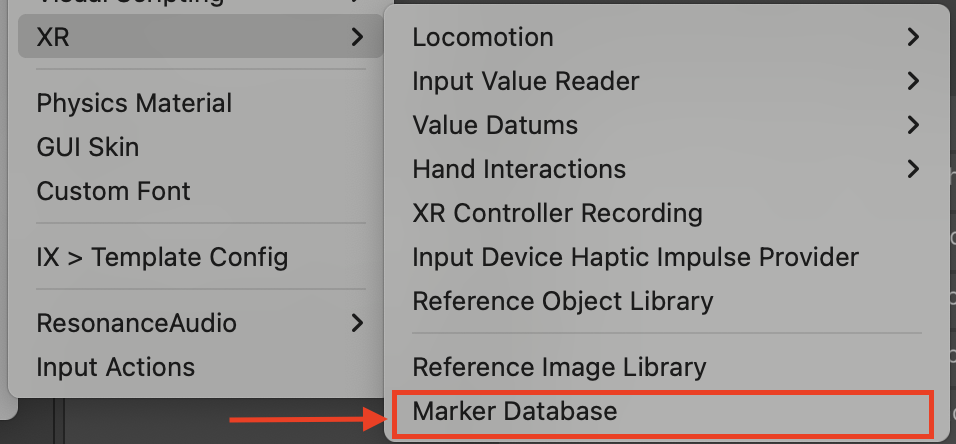
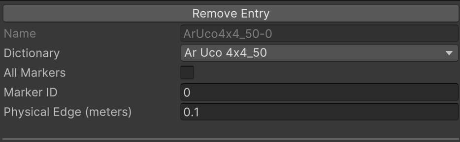
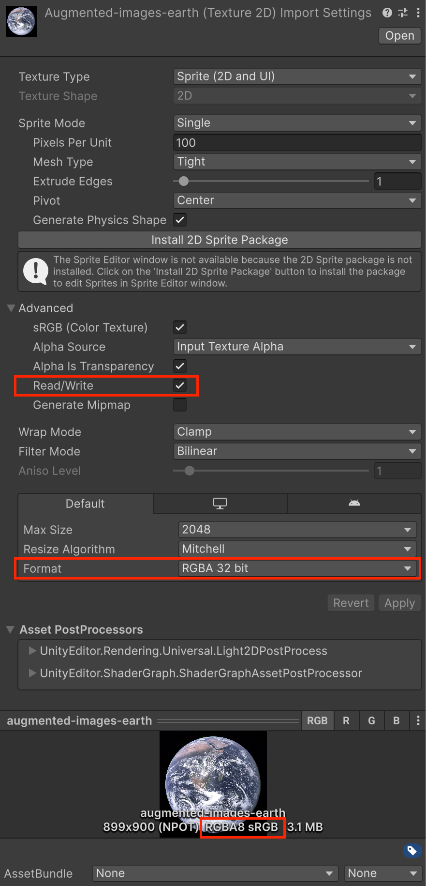
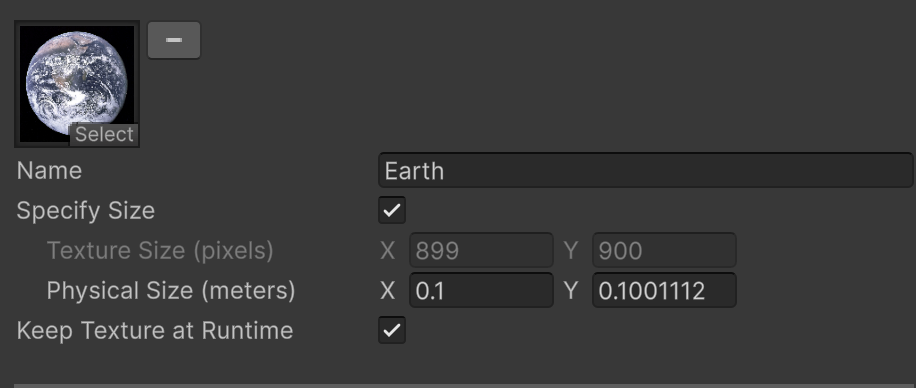
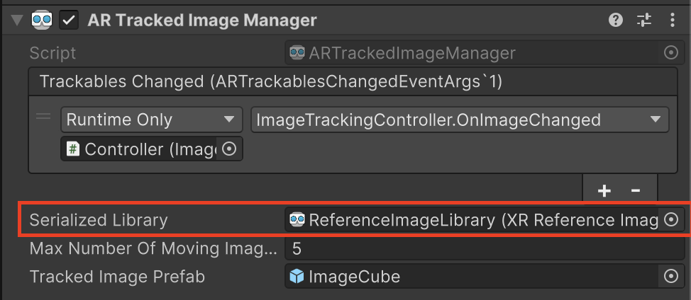

# Image Tracking Sample

Demonstrates Android XR Image Tracking feature and general AR Foundation usage
at OpenXR runtime targeting Android Platform with Android XR Provider.

## Enable Android XR Subsystems

To enable the sample:

*   Navigate to **Edit** > **Project Settings** > **XR Plug-in Management** >
    **OpenXR**.
*   Switch to the **Android** tab.
*   Select **Android XR (Extensions): Session Management**.
*   Select **Android XR (Extensions): Image Tracking (QR Code)**.
*   Select **Android XR (Extensions): Image Tracking (Marker)**.
*   Select **Android XR (Extensions): Image Tracking**.
*   Under **XR Plug-in Management > Project Validation**, fix all **OpenXR**
    related issues. This will help to configure your **Player Settings**.

If you have **Unity OpenXR Android XR** imported, you can also enable
passthrough by:

*   Navigate to **Edit** > **Project Settings** > **XR Plug-in Management** >
    **OpenXR**, switch to **Android XR** feature group.
*   Select **Android XR Support**.
*   Select **Android XR: AR Session**.
*   Select **Android XR: AR Camera**.
*   Refer to manual
    [AR Camera](https://docs.unity3d.com/Packages/com.unity.xr.androidxr-openxr@1.2/manual/features/camera.html#passthrough)
    for more details.

You can then build the Image Tracking sample with the default library which has
a QR Code reference, multiple marker references, and an image reference.

How to configure a custom image library:

*   Navigate to **Assets > Create > XR > Reference Image Library** to create a
    new library.

    

*   Open the new image library.

*   Add **QrCode** reference:

    *   Click **Add Image** and name it **QrCode** which will determine if this
        is a QR Code reference.
    *   Select **Specify Size** and specify **Physical Size (meters)**. The
        width of the physical size will be used as the QR code edge for QR code
        tracking.
    *   If you prefer size estimation, open the **Setting** menu of **Android XR
        (Extensions) Image Tracking (QR Code)**, then select **Prefer
        Estimation** to indicate the auto-estimation when it's supported by the
        OpenXR runtime.
    *   Note: only the first QR Code reference will take effect.

        

*   Add **Marker** references:

    *   **Marker** references follow name format **{XRMarkerDictionary}-{id}**.
        You can either create it from **Marker Database**, or manually add them
        with the name format, then select **Specify Size** and specify
        **Physical Size (meters)**.

        

    *   To use **Marker Database**, navigate to **Assets > Create > XR > Marker
        Database** and create a new database.

        

        *   Click **Add Entry** and select **Dictionary** of this entry.
        *   Select **All Markers** if you want to track all markers from this
            dictionary or fill **Marker ID** for an individual marker from this
            dictionary.
        *   If you have created an **All Marker** entry from a given dictionary,
            any individual entries from the same dictionary is not allowed.

            

        *   After fixed all validation errors, you can then create a new library
            or update the image library created above. It will remove all marker
            references and append new entries from the current database.

    *   If you prefer size estimation, open the **Setting** menu of **Android XR
        (Extensions) Image Tracking (Marker)**, then select **Prefer
        Estimation** to indicate the auto-estimation when it's supported by the
        OpenXR runtime.

*   Add **Image** reference:

    *   Click **Add Image** and fill in the fields:

    *   Select a **Texture 2D** to use as the image reference.
        *   Ensure the **Read/Write** flag is enabled in the advanced Texture
            Import Settings.
        *   Ensure the texture's **Format** is set to **RGBA8** (i.e., RGBA 32-
            bit). Setting the **Format** to **Automatic** may result in an
            incompatible format.

        

    *   Specify a **Name**, which can be used to identify which reference image
        has been detected at runtime.
        *   The **Names** must not be "QRCode" or follow the marker format
            "{XRMarkerDictionary}-{id}" to avoid misclassification.
        *   Duplicated **Names** for **Image** references are allowed.

    *   Enable **Keep Texture at Runtime**, otherwise image tracking will not
        work for the added image reference. This is necessary, as the runtime
        must access the source texture via "XRReferenceImage.texture" in order
        to pass it to OpenXR.

    *   Physical Size:
        *   Select **Specify Size** and specify **Physical Size (meters)**,
            which should represent the actual dimensions of the image target in
            the real world.
        *   If you prefer size estimation, open the **Setting** menu of
            **Android XR (Extensions) Image Tracking (Image)**, then select
            **Prefer Estimation** to indicate automatic size estimation when
            supported by the OpenXR runtime. It's recommended to still specify
            a **Physical Size (meters)** as default, as some providers do not
            support size estimation.

    

*   Assign the custom library to **AR Tracked Image Manager** in the scene.

    
