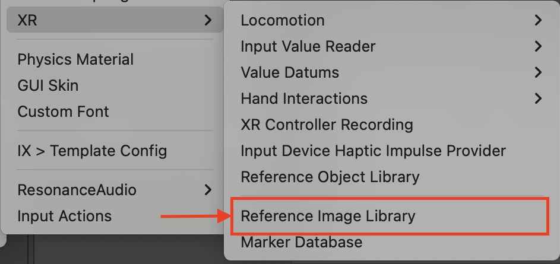
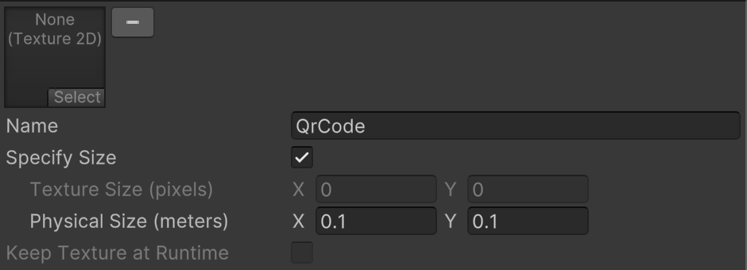
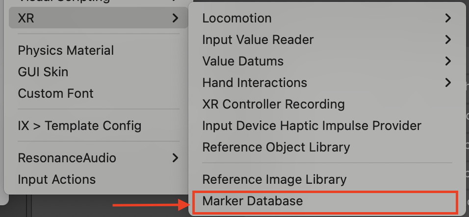
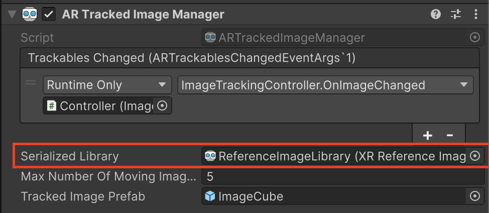

# Image Tracking Sample

Demonstrates Android XR Image Tracking feature and general AR Foundation usage
at OpenXR runtime targeting Android Platform with Android XR Provider.

## Enable Android XR Subsystems

To enable the sample:

*   Navigate to **Edit** > **Project Settings** > **XR Plug-in Management** >
    **OpenXR**.
*   Switch to the **Android** tab.
*   Select **Android XR (Extensions): Session Management**.
    *   Known issue: Vulkan Subsampling now causes offset of image tracking.
        To disable it, under the setting menu of **Android XR (Extensions)
        Session Management**, unselect **Subsampling (Vulkan)**.
*   Select **Android XR (Extensions): Image Tracking (QR Code)**.
*   Select **Android XR (Extensions): Image Tracking (Marker)**.
*   Select **Environment Blend Mode** and open **Setting** menu, set **Request
    Mode** to **Alpha Blend** which gives a better visual result.
*   Under **XR Plug-in Management > Project Validation**, fix all **OpenXR**
    related issues. This will help to configure your **Player Settings**.

You can then build the Image Tracking sample with the default library which has
a QR Code reference and multiple marker references.

How to configure a custom image library:

*   Naviagte to **Assets > Create > XR > Reference Image Library** to create a
    new library.

    

*   Open the new image library.

*   Add **QrCode** reference:

    *   Click **Add Image** and name it **QrCode** which will determine if this
        is a QR Code reference.
    *   Select **Specify Size** and specify **Physical Size (meters)**. The
        width of the physical size will be used as the QR code edge for QR code
        tracking.
    *   If you prefer size estimation, open the **Setting** menu of **Android XR
        (Extensions) Image Tracking (QR Code)**, then select **Prefer
        Estimation** to indicate the auto-estimation when it's supported by the
        OpenXR runtime.
    *   Note: only the first QR Code reference will take effect.

        

*   Add **Marker** references:

    *   **Marker** references follow name format **{XRMarkerDictionary}-{id}**.
        You can either create it from **Marker Database**, or manually add them
        with the name format, then select **Specify Size** and specify
        **Physical Size (meters)**.

        

    *   To use **Marker Database**, navigate to **Assets > Create > XR > Marker
        Database** and create a new database.

        

        *   Click **Add Entry** and select **Dictionary** of this entry.
        *   Select **All Markers** if you want to track all markers from this
            dictionary or fill **Marker ID** for an individual marker from this
            dictionary.
        *   If you have created an **All Marker** entry from a given dictionary,
            any individual entries from the same dictionary is not allowed.

            

        *   After fixed all validation errors, you can then create a new library
            or update the image library created above. It will remove all marker
            references and append new entries from the current database.

    *   If you prefer size estimation, open the **Setting** menu of **Android XR
        (Extensions) Image Tracking (Marker)**, then select **Prefer
        Estimation** to indicate the auto-estimation when it's supported by the
        OpenXR runtime.

*   Assign the custom library to **AR Tracked Image Manager** in the scene.

    
